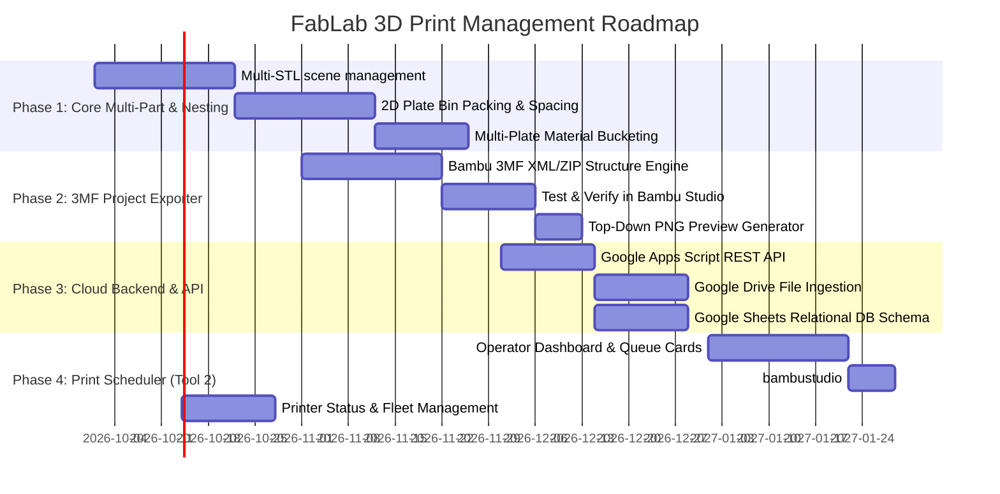

# FabLab 3D Print Management System — Future Architecture & Roadmap Plan

> **Status**: Architectural Blueprint & Future Planning Document  
> **Target Environment**: MakerSpaces, FabLabs, Prototyping Labs operating Bambu Lab printers (P1P, P1S, X1C, A1 series)  
> **Document Purpose**: Synthesizes the two-tier tool model (Plate Builder vs. Print Scheduler), cloud backend architecture (Google Drive + Sheets + Apps Script), and technical integration with Bambu Studio.

---

## 1. Executive Summary & Core Insights

The current codebase contains a robust single-part 3D inspection and preparation tool:
- High-performance STL parsing, bounding box calculation, center of mass, and volume computation.
- Automated orientation, planar facet extraction, shrink-wrapped convex hull landing discs, and physics-based Gravity Fall settling.
- Three.js 3D viewport, CAD ViewCube, transform gizmos, bed fit validation (256 × 256 mm), and print requirement estimation.

### Key Insights from the Proposed Architecture
1. **Separation of Concerns (Two Independent Tools)**:
   - **Tool 1 (FabLab Plate Builder)**: End-user/team facing. Part upload, orientation, material/color assignment, auto-nesting, multi-plate grouping, preview generation, and 3MF packaging.
   - **Tool 2 (FabLab Print Scheduler)**: Operator/technician facing. Printer fleet monitoring, visual plate queue, material readiness verification, status management, and 1-click opening in Bambu Studio.
2. **Pragmatic Slicing Boundary**:
   - Avoid implementing a client-side G-code slicing engine. Tool 1 packages a **fully configured, valid Bambu Studio 3MF project** (parts positioned, oriented, filament and print profiles assigned). Bambu Studio remains the final slicer and machine controller.
3. **Zero-Maintenance Serverless Backend**:
   - **Google Drive**: Stores raw STLs, generated `.3mf` plate files, and top-down `.png` plate previews.
   - **Google Sheets**: Acts as the operational relational database (`Jobs`, `Plates`, `Parts`, `Printers`, `Materials`).
   - **Google Apps Script**: Acts as the serverless Web API layer, abstracting Drive and Sheets credentials from the browser.
4. **Instant Visual Queue via Canvas Snapshots**:
   - The browser captures an orthographic top-down snapshot (`toDataURL()`) of each plate during generation. The Scheduler renders these lightweight images immediately without instantiating heavy WebGL scenes for dozens of queued plates.
5. **One-Click Hand-off via Custom Protocol**:
   - Using the `bambustudio://open?file=https://...` URI scheme, the operator clicks **"Open in Bambu"** in the Scheduler, and Bambu Studio automatically fetches and opens the pre-arranged plate ready to slice and send.

---

## 2. High-Level Architecture Diagram

```text
┌─────────────────────────────────────────────────────────────────────────┐
│                           FABLAB TEAMS & STUDENTS                       │
│                   (Robotics, Mechanical, Electronics, etc.)             │
└────────────────────────────────────┬────────────────────────────────────┘
                                     │
                                     ▼
                   ┌───────────────────────────────────┐
                   │    TOOL 1: FABLAB PLATE BUILDER   │
                   │  - Multi-STL / 3MF Ingestion      │
                   │  - Orientation (Auto / Gravity)   │
                   │  - Material & Color Tagging       │
                   │  - Plate Bin-Packing & Nesting    │
                   │  - Plate Preview PNG Capture      │
                   │  - Bambu 3MF Project Packaging    │
                   └─────────────────┬─────────────────┘
                                     │ JSON Payload + Blobs (3MF, PNG, STL)
                                     ▼
                   ┌───────────────────────────────────┐
                   │     GOOGLE APPS SCRIPT WEB API    │
                   │     (doPost / doGet Endpoints)    │
                   └─────────┬───────────────────┬─────┘
                             │                   │
                File Blobs   │                   │ Rows & Updates
                             ▼                   ▼
                   ┌───────────────────┐       ┌───────────────────┐
                   │   GOOGLE DRIVE    │       │   GOOGLE SHEETS   │
                   │   - Raw STLs      │       │   - Jobs          │
                   │   - Plate 3MFs    │       │   - Plates        │
                   │   - Preview PNGs  │       │   - Parts         │
                   │                   │       │   - Printers      │
                   │                   │       │   - Materials     │
                   └─────────┬─────────┘       └─────────┬─────────┘
                             │ Read URLs                 │ Read Metadata
                             └───────────┬───────────────┘
                                         ▼
                   ┌───────────────────────────────────┐
                   │   TOOL 2: FABLAB PRINT SCHEDULER  │
                   │  - Printer Fleet Status Cards     │
                   │  - Visual Plate Queue Cards       │
                   │  - Material Matching & Filters    │
                   │  - Status Tracking (Queued→Done)  │
                   │  - 3MF Download & Direct Launch   │
                   └─────────────────┬─────────────────┘
                                     │ bambustudio://open?file=...
                                     ▼
                   ┌───────────────────────────────────┐
                   │           BAMBU STUDIO            │
                   │  (One-click review, slice & send) │
                   └─────────────────┬─────────────────┘
                                     │ Wi-Fi / Cloud
                                     ▼
                   ┌───────────────────────────────────┐
                   │     BAMBU PRINTER FLEET (P1S)     │
                   └───────────────────────────────────┘
```

---

## 3. Tool 1: FabLab Plate Builder (End-User App)

### 3.1 Key Responsibilities
- **Multi-Part Ingestion**: Allow drag-and-drop of multiple STLs/3MFs simultaneously.
- **Part Attributes**:
  - Material (PLA, PETG, TPU, ABS, etc.)
  - Color (Black, White, Orange, Grey, etc.)
  - Target Layer Height & Infill Density
  - Priority & Required-by Date
- **Orientation Pipeline**:
  - Leverage our existing auto-orient, Gravity Fall settling, and lay-on-face algorithms per part.
- **Automatic Plate Grouping**:
  - Incompatible materials or colors cannot share the same non-AMS build plate (or can be grouped based on AMS capabilities).
  - Automatically bucket parts into:
    $$\text{Parts} \xrightarrow{\text{group by}} (\text{Material}, \text{Color}, \text{Printer Target}) \xrightarrow{\text{bin-pack}} \text{Plate } 1, 2, \dots, N$$
- **2D Bin-Packing / Nesting Algorithm**:
  - Compute 2D convex hull / bounding polygon footprints on the bed ($Z = 0$).
  - Arrange parts onto the $256 \times 256\text{ mm}$ bed with user-configurable margin (e.g., $3\text{ mm}$ part spacing, $5\text{ mm}$ plate edge clearance).
  - If parts exceed one plate, spill over into `Plate 02`, `Plate 03`, etc.
- **Manual Adjustments**:
  - Allow operators/users to drag, rotate ($90^\circ$ increments), duplicate, or move parts between plates before finalizing.
- **Artifact Export**:
  - Top-down orthographic snapshot captured via Three.js:
    ```javascript
    camera.position.set(0, 400, 0);
    camera.lookAt(0, 0, 0);
    renderer.render(scene, camera);
    const previewPngBase64 = renderer.domElement.toDataURL('image/png');
    ```
  - Bambu Studio 3MF bundle generation (ZIP archive containing 3D models and `model_settings.config`).

---

## 4. Tool 2: FabLab Print Scheduler (Operator App)

### 4.1 Key Responsibilities
- **Fleet Overview**:
  - Live status cards for lab printers: `P1S-01 (Idle)`, `P1S-02 (Printing - 42m remaining)`, `P1S-03 (Maintenance)`.
- **Plate Queue View**:
  - Grouped or filtered by Material and Color to batch print jobs without frequent filament changes.
  - Card view displays:
    - Plate thumbnail image (from Google Drive).
    - Team & Requester Name, Project title.
    - Material, Color, estimated weight (g), layer count.
    - Status badges: `Draft`, `Submitted`, `Queued`, `Printing`, `Completed`, `Failed`.
- **One-Click Production Launch**:
  - **Open in Bambu**: Deep-link trigger:
    ```html
    <a href="bambustudio://open?file=https://drive.google.com/uc?export=download&id=DRIVE_FILE_ID">
      Open in Bambu Studio
    </a>
    ```
  - **Download 3MF**: Direct offline download for SD card / USB transfer.
- **Status Lifecycle Control**:
  - Operator marks plate as `Printing` (assigns to `P1S-01`), then `Completed` or `Failed`.
  - Automatically updates Google Sheets timestamp and totals.

---

## 5. Backend & Data Architecture

### 5.1 Google Drive Storage Structure
```text
FabLab_Production/
├── Jobs/
│   └── 2026/
│       ├── JOB-2026-0001_Robotics_Arm/
│       │   ├── originals/
│       │   │   ├── base.stl
│       │   │   ├── gear.stl
│       │   │   └── gripper.stl
│       │   ├── plates/
│       │   │   ├── JOB-0001-PL01_PLA_Black.3mf
│       │   │   └── JOB-0001-PL02_PETG_White.3mf
│       │   └── previews/
│       │       ├── PL01_preview.png
│       │       └── PL02_preview.png
│       └── JOB-2026-0002_Drone_Frame/
└── Archive/
```

### 5.2 Google Sheets Database Schema

#### Tab 1: `Jobs`
| Column | Type | Example |
| :--- | :--- | :--- |
| `job_id` | String (PK) | `JOB-2026-0042` |
| `created_at` | ISO Timestamp | `2026-09-11T14:30:00Z` |
| `team` | String | `Robotics Club` |
| `requester_name` | String | `Jogin Francis` |
| `requester_email` | String | `jogin@fablab.edu` |
| `project_name` | String | `Autonomous Rover Chassis` |
| `priority` | Enum | `Normal` \| `High` \| `Urgent` |
| `overall_status` | Enum | `Queued` \| `In Progress` \| `Completed` |
| `notes` | Text | `Requires high infill for structural motor mounts` |

#### Tab 2: `Plates`
| Column | Type | Example |
| :--- | :--- | :--- |
| `plate_id` | String (PK) | `PLT-0042-01` |
| `job_id` | String (FK) | `JOB-2026-0042` |
| `plate_number` | Integer | `1` |
| `printer_model` | String | `Bambu P1S` |
| `assigned_printer`| String | `P1S-02` |
| `material` | String | `PLA` |
| `color` | String | `Matte Black` |
| `part_count` | Integer | `8` |
| `est_time_min` | Integer | `184` |
| `est_material_g` | Float | `94.5` |
| `est_cost_inr` | Float | `189.00` |
| `preview_url` | URL | `https://drive.google.com/.../PL01_preview.png` |
| `file_3mf_url` | URL | `https://drive.google.com/.../PL01.3mf` |
| `status` | Enum | `Queued` \| `Printing` \| `Completed` \| `Failed` |
| `started_at` | ISO Timestamp | `2026-09-11T16:00:00Z` |
| `finished_at` | ISO Timestamp | `2026-09-11T19:08:00Z` |

#### Tab 3: `Parts`
| Column | Type | Example |
| :--- | :--- | :--- |
| `part_id` | String (PK) | `PRT-0042-01` |
| `job_id` | String (FK) | `JOB-2026-0042` |
| `plate_id` | String (FK) | `PLT-0042-01` |
| `file_name` | String | `bracket_left.stl` |
| `quantity` | Integer | `2` |
| `volume_cm3` | Float | `14.2` |
| `dimensions_mm` | String | `45.0 x 60.0 x 30.0` |
| `orientation` | String | `Auto (Min Overhang)` |

#### Tab 4: `Printers`
| Column | Type | Example |
| :--- | :--- | :--- |
| `printer_id` | String (PK) | `P1S-01` |
| `name` | String | `Bambu P1S Lab Alpha` |
| `nozzle_size_mm` | Float | `0.4` |
| `loaded_spool` | String | `Bambu PLA Basic Black` |
| `status` | Enum | `Available` \| `Printing` \| `Maintenance` \| `Offline` |
| `current_plate_id`| String (FK) | `PLT-0042-01` |

#### Tab 5: `Materials`
| Column | Type | Example |
| :--- | :--- | :--- |
| `material_id` | String (PK) | `MAT-PLA-BLK` |
| `material_name` | String | `PLA` |
| `color_name` | String | `Black` |
| `cost_per_kg` | Float | `1800.00` |
| `density_g_cm3` | Float | `1.24` |
| `in_stock_spools`| Integer | `6` |

---

## 6. Bambu 3MF Project Packaging Specification

A Bambu Studio `.3mf` file is an OPC (Open Packaging Convention) ZIP archive. To produce native project files:

```text
Plate_001.3mf (ZIP Archive)
├── [Content_Types].xml
├── _rels/
│   └── .rels
├── 3D/
│   ├── 3dmodel.model            <-- XML containing mesh vertices, triangles, and object placements
│   └── Metadata/
│       └── model_settings.config <-- Bambu Studio plate layouts, colors, infill, layer heights
└── Metadata/
    └── plate_1.png              <-- Thumbnail rendered by Bambu Studio
```

### Key Technical Milestone
Rather than manually writing ZIP parsing from scratch, use lightweight JavaScript libraries:
- `fflate` or `jszip` for in-browser ZIP compression.
- Generate standard `<mesh>` entries in `3D/3dmodel.model`.
- Generate `<item objectid="1" transform="m00 m01 m02 m10 m11 m12 m20 m21 m22 x y z"/>` for plate positioning.
- Include Bambu process configurations so opening the file pre-selects the P1S profile.

---

## 7. Phased Implementation Roadmap



### Detailed Phase Milestones

#### Phase 1: Multi-Part Plate Builder Engine (Tool 1 Frontend)
- Upgrade current single-mesh view to a multi-part list (`Map<id, PartEntry>`).
- Implement 2D bounding footprint extraction on the build bed.
- Implement a 2D Rectangle / Convex Polygon bin-packing algorithm for $256 \times 256\text{ mm}$ beds with $3\text{ mm}$ part clearance and $5\text{ mm}$ edge border.
- Implement material/color clustering into distinct plates (`Plate 1`, `Plate 2`, ...).

#### Phase 2: Native Bambu 3MF Generation (Browser-side)
- Build a lightweight `Bambu3MFWriter` module in vanilla JS.
- Bundle the placed meshes with transformation matrices into `3D/3dmodel.model`.
- Inject Bambu Studio process settings (layer height, walls, infill, plate ID).
- Add top-down orthographic camera capture to generate `preview.png`.

#### Phase 3: Serverless Backend (Apps Script + Drive + Sheets)
- Set up a Google Apps Script Web App handling:
  - `POST /uploadJob`: Receives job metadata, raw STLs, generated `.3mf` files, and `.png` previews; saves to Drive; inserts rows into `Jobs`, `Plates`, and `Parts` tabs.
  - `GET /getQueue`: Returns active queued plates with Drive preview URLs and job details.
  - `POST /updatePlateStatus`: Updates plate status (`Queued` $\to$ `Printing` $\to$ `Completed`).

#### Phase 4: FabLab Print Scheduler Dashboard (Tool 2 Frontend)
- Build the operator dashboard with live printer status tags.
- Visual plate cards showing thumbnail, team, material, weight, and print time.
- Integrated `bambustudio://open?file=...` link for instant slicer launching.
- Filter queue by material/color to minimize spool swap downtime.

---

## 8. Summary of Reusable Assets in Current Project

Our existing codebase already provides several core algorithms needed for this architecture:

| Existing Module | Current Capability | Reuse in New System |
| :--- | :--- | :--- |
| [`stl_parser.js`](file:///c:/Users/ADMIN/OneDrive/Documents/Projects/3D%20print%20management/stl_parser.js) | Binary/ASCII STL parser, bounds, surface area, volume calculation. | Direct reuse for part ingestion and footprint extraction. |
| [`convex_hull.js`](file:///c:/Users/ADMIN/OneDrive/Documents/Projects/3D%20print%20management/convex_hull.js) | 2D/3D Convex hull computation and polygon insetting. | Used directly for part footprint calculation during 2D bin-packing. |
| [`estimator.js`](file:///c:/Users/ADMIN/OneDrive/Documents/Projects/3D%20print%20management/estimator.js) | Slicing profile estimation, layer counts, material grams, and pricing. | Used directly to populate plate summary cards and Sheets metadata. |
| [`app.js`](file:///c:/Users/ADMIN/OneDrive/Documents/Projects/3D%20print%20management/app.js) | Gravity Fall physics settling, auto-orientation, TransformControls, CAD ViewCube. | Used directly in Tool 1's 3D viewport for part orientation and placement. |
